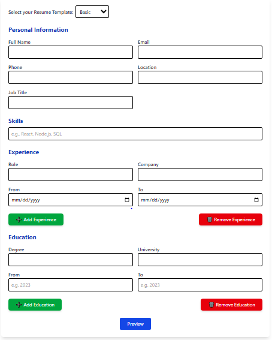
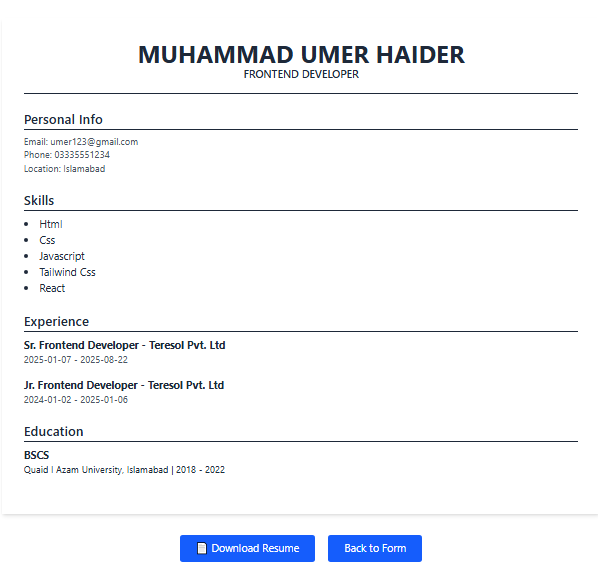

# 📝 Resume Builder Web App

A fully responsive, customizable **Resume Builder Web Application** built using **React**, **Tailwind CSS**. It allows users to fill in personal and professional information, preview their resume in different templates (Basic/Modern), and download the final version as a PDF.

## 🚀 Features

- 🔄 Multi-step Resume Form (Personal Info, Summary, Skills, Education, Experience, Projects)
- 🎨 Supports multiple design templates (Basic, Modern)
- ⚡ Real-time Preview of Resume
- 🧠 Form validation with user-friendly alerts (using SweetAlert2)
- 💾 Data persistence using `localStorage`
- 📄 Download resume as PDF
- ↩️ Back button to update form without data loss

## 🛠️ Tech Stack

| Frontend      | Styling         | Alerts        |
|---------------|-----------------|----------------|
| React         | Tailwind CSS    | SweetAlert2   |

## 📸 Screenshots

| Form Page                                   | Resume Preview                                 |
|--------------------------------------------|------------------------------------------------|
|       |     |

## ✅ How It Works

1. Users fill out resume fields in a clean form UI.
2. On submit, form data is validated and stored in `localStorage`.
3. Navigate to the preview page using React Router.
4. Preview renders based on selected template.
5. Users can click **Back** to edit, or **Download PDF**.

